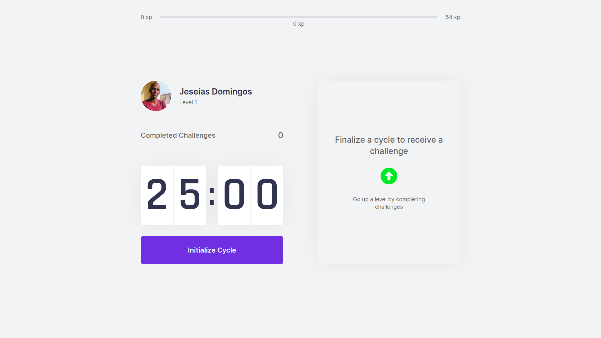

<h1 style="text-align: center; font-size: 50px; color: #5965E0;">move.it</h1>

## This app was created for learning purposes, on course named __NLW__ (Next Level Week) by [_@rocketseat_](https://www.rocketseat.com.br).

# App purpose

#### This application __aims__ help __developers__, take care of their __health__, since we spend so much time __coding__, while __sitting__, staring at the __screen__ for a very ling time.

#### This app __reminds__ us after 25 minutes, to take a __break__, and do a variety of __exercises__, on the eyes, neck, fingers, etc...

# Features 
>- #### __Experience bar__  
>- #### __Countdown timer__ 
>- #### __Levels__ 
>- #### __Notifications__ 
>- #### __Simple Authentication with (using github username)__ 

# Technologies used

> #### 1. __Next.JS__
> #### 2. __REACTJS__

# Concepts used in in this application

> #### 1. __Context API__
> #### 2. __getServerSideProps__
> #### 3. __Styled-components__
> #### 4. __Audio API__
> #### 5. __Notification API__
> #### 6. __Test with Jest__
> #### 7. __TypeScript__

# Development 

> #### 1. __Eslint__
> #### 2. __Prettier__ 